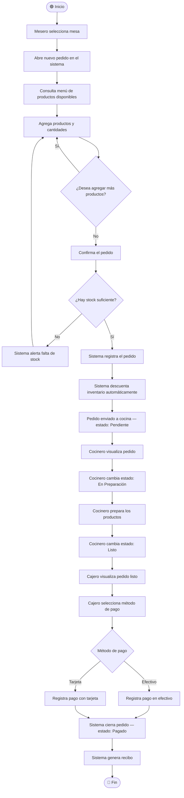
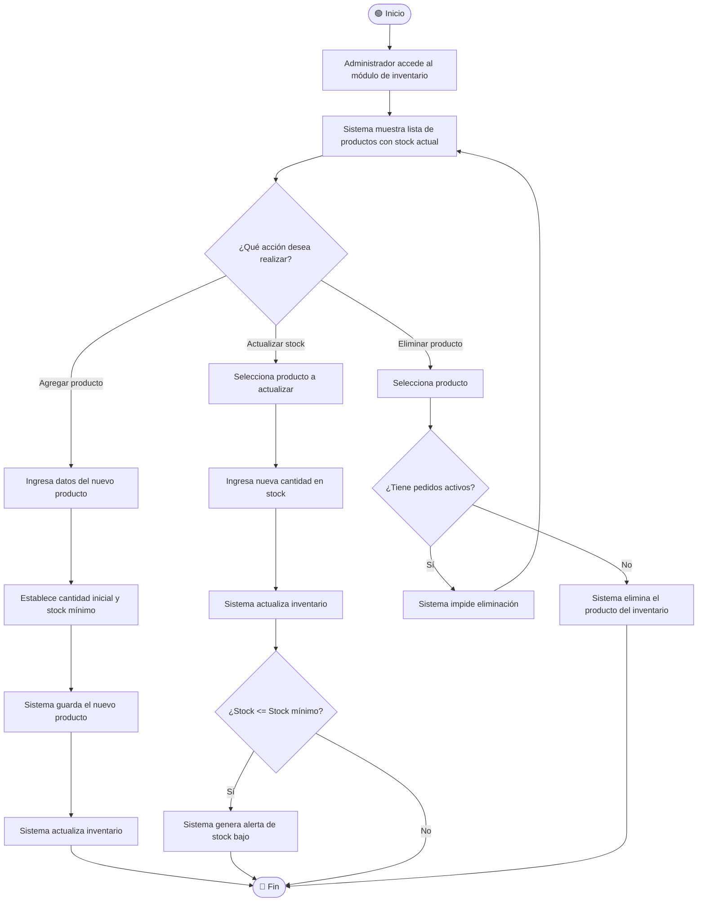
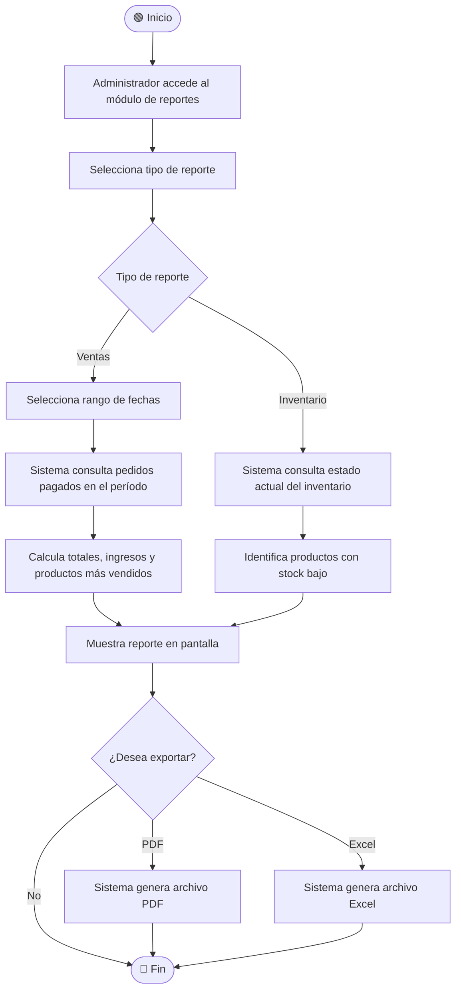

# Diagrama de Actividades — Sistema de Gestión de Pedidos e Inventario

---

## DA-01: Proceso Completo de un Pedido

---

## DA-02: Gestión de Inventario

---

## DA-03: Generar Reporte de Ventas

