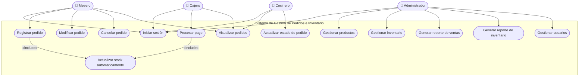

# Diagrama de Casos de Uso — Sistema de Gestión de Pedidos e Inventario

## Actores del Sistema

| Actor | Descripción |
|-------|-------------|
| **Administrador** | Gestiona productos, usuarios y reportes del sistema |
| **Mesero** | Toma pedidos y los envía a cocina |
| **Cajero** | Procesa pagos y cierra cuentas |
| **Cocinero** | Visualiza los pedidos y actualiza su estado |

---

## Diagrama (Mermaid)

---

## Descripción de Casos de Uso Principales

### CU-01: Iniciar Sesión
- **Actor primario:** Todos los usuarios
- **Precondición:** El usuario debe estar registrado en el sistema
- **Flujo principal:**
  1. El usuario ingresa su correo y contraseña
  2. El sistema valida las credenciales
  3. El sistema redirige al panel según el rol del usuario
- **Flujo alternativo:** Si las credenciales son incorrectas, el sistema muestra un mensaje de error

---

### CU-04: Registrar Pedido
- **Actor primario:** Mesero
- **Precondición:** El mesero debe haber iniciado sesión
- **Flujo principal:**
  1. El mesero selecciona la mesa o cliente
  2. Busca y agrega productos al pedido
  3. Confirma el pedido
  4. El sistema registra el pedido y envía notificación a cocina
  5. El sistema actualiza el inventario automáticamente (**include** CU-13)
- **Flujo alternativo:** Si un producto no tiene stock, el sistema alerta al mesero

---

### CU-03: Gestionar Inventario
- **Actor primario:** Administrador
- **Precondición:** El administrador debe haber iniciado sesión
- **Flujo principal:**
  1. El administrador consulta el inventario actual
  2. Agrega, edita o elimina ítems del inventario
  3. Configura el stock mínimo de alerta por producto
  4. El sistema guarda los cambios

---

### CU-09: Procesar Pago
- **Actor primario:** Cajero
- **Precondición:** El pedido debe estar en estado "Listo"
- **Flujo principal:**
  1. El cajero selecciona el pedido a cobrar
  2. El sistema muestra el resumen de la cuenta
  3. El cajero selecciona el método de pago (efectivo / tarjeta)
  4. El sistema registra el pago y cierra el pedido
  5. El sistema actualiza el inventario (**include** CU-13)

---

### CU-10: Generar Reporte de Ventas
- **Actor primario:** Administrador
- **Flujo principal:**
  1. El administrador selecciona el rango de fechas
  2. El sistema genera el reporte de ventas del período
  3. El reporte muestra total de pedidos, ingresos y productos más vendidos
  4. El administrador puede exportar el reporte en PDF/Excel
