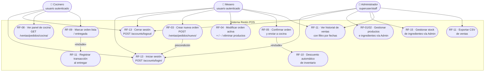

# Diagrama de Casos de Uso — Sistema de Gestión de Pedidos e Inventario

> Actualizado para reflejar la implementación real del proyecto.

## Actores del Sistema

| Actor | Descripción |
|-------|-------------|
| **Usuario autenticado** | Cualquier usuario que haya iniciado sesión (mesero, cocinero, admin) |
| **Mesero** | Crea, modifica y confirma órdenes |
| **Cocinero** | Visualiza las órdenes confirmadas y actualiza su estado |
| **Administrador** | Gestiona productos, ingredientes e inventario vía Django Admin |

> **Nota:** El sistema actual usa autenticación por sesiones de Django (`django.contrib.auth`).
> Los roles se distinguen por permisos de Django (staff/superuser para el admin).

---

## Diagrama (Mermaid)

---

## Descripción de Casos de Uso Principales

### CU-RF13: Iniciar / Cerrar Sesión
- **Actor primario:** Todos los usuarios
- **Backend:** `RateLimitedLoginView` — Django `LoginView` con rate limiting en caché (5 intentos / 15 min)
- **Contraseñas:** hasheadas con `BCryptSHA256PasswordHasher`
- **Sesión:** gestionada con `django.contrib.sessions` (persiste entre recargas)
- **Flujo login:** POST `/accounts/login/` → valida credenciales → crea sesión → redirige a `/ventas/pedidos/`
- **Flujo logout:** POST `/accounts/logout/` → invalida sesión → redirige a `/accounts/login/`
- **Flujo alternativo:** Credenciales inválidas → muestra error con intentos restantes; 5 fallos → bloqueo 15 min

---

### CU-RF03: Crear Nueva Orden
- **Actor primario:** Mesero (usuario autenticado)
- **Precondición:** Sesión iniciada (`LoginRequiredMixin`)
- **Flujo:** GET `/ventas/pedidos/nuevo/` → formulario con campo `mesa_o_online` → POST → crea `Pedido` (estado=`pendiente`) → redirige al detalle con mensaje de éxito
- **Validación:** El campo `mesa_o_online` es obligatorio

---

### CU-RF04: Modificar Orden Activa
- **Actor primario:** Mesero
- **Precondición:** Orden en estado `pendiente`; si el estado es distinto, las acciones de edición no se muestran
- **Flujo:** Agregar producto → POST al detalle; cambiar cantidad → POST `/items/M/incrementar|disminuir/`; eliminar → POST `/items/M/eliminar/` (con confirmación JS)
- **Búsqueda:** Filtro en tiempo real sobre el `<select>` de productos mediante JavaScript

---

### CU-RF05: Confirmar Orden y Enviar a Cocina
- **Actor primario:** Mesero
- **Precondición:** Orden en estado `pendiente` con al menos 1 producto
- **Flujo:** Botón "Confirmar Orden" → diálogo `confirm()` en JS → POST `/ventas/pedidos/N/confirmar/` → verifica stock → descuenta ingredientes → registra `MovimientoInventario` → cambia estado a `en_preparacion` → muestra mensaje de éxito
- **Flujo alternativo:** Stock insuficiente → muestra lista de ingredientes faltantes y cantidades

---

### CU-RF08/09: Panel de Cocina
- **Actor primario:** Cocinero
- **Flujo:** GET `/ventas/pedidos/cocina/` → lista pedidos en `en_preparacion` y `listo` → botones para avanzar estado (listo → entregada)
- **Auto-recarga:** Cada 10 segundos con `setTimeout`

---

### CU-RF10: Descuento Automático de Inventario
- **Disparador:** Al confirmar orden (RF-05)
- **Lógica:** Para cada `PedidoProducto`, consulta `ProductoIngrediente` (receta); descuenta `ingrediente.stock`; registra `MovimientoInventario` con `tipo='descuento'`

