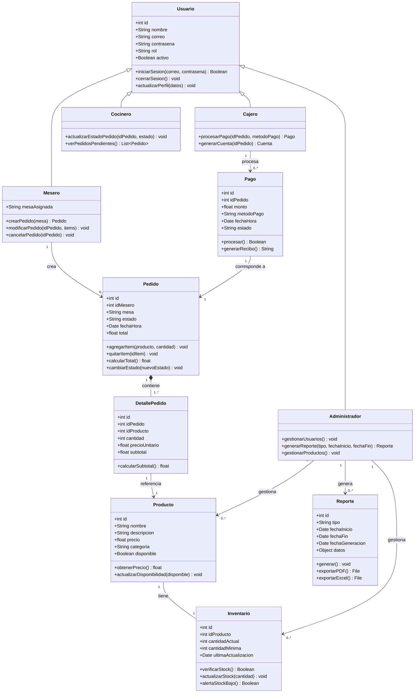
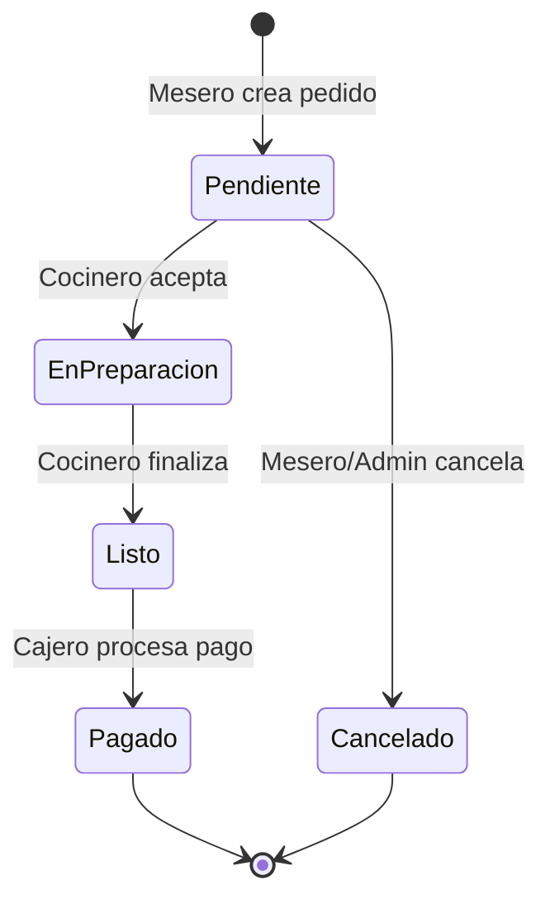

# Diagrama de Clases — Sistema de Gestión de Pedidos e Inventario

## Diagrama (Mermaid)

---

## Descripción de las Clases

| Clase | Responsabilidad |
|-------|-----------------|
| `Usuario` | Clase base para todos los usuarios del sistema; maneja autenticación |
| `Administrador` | Hereda de Usuario; gestiona productos, usuarios y reportes |
| `Mesero` | Hereda de Usuario; crea y gestiona pedidos |
| `Cajero` | Hereda de Usuario; procesa pagos y genera cuentas |
| `Cocinero` | Hereda de Usuario; actualiza el estado de los pedidos |
| `Producto` | Representa un ítem del menú con precio y disponibilidad |
| `Inventario` | Controla el stock de cada producto con alertas de mínimos |
| `Pedido` | Agrupa los ítems solicitados por una mesa; tiene estado de ciclo de vida |
| `DetallePedido` | Línea de cada pedido: producto + cantidad + precio unitario |
| `Pago` | Registra la transacción económica asociada a un pedido |
| `Reporte` | Genera y exporta información estadística del sistema |

---

## Estados del Pedido

