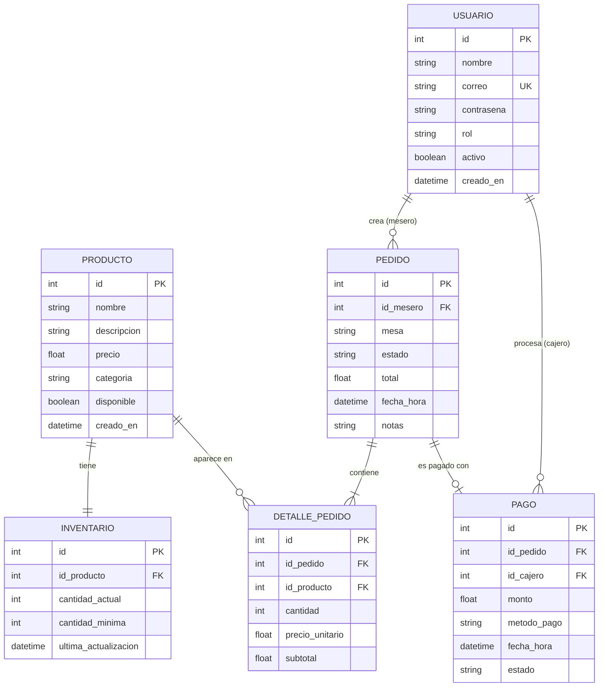

# Diagrama Entidad-Relación (ER) — Sistema de Gestión de Pedidos e Inventario

## Diagrama (Mermaid)

---

## Descripción de las Entidades

### USUARIO
Almacena todos los usuarios del sistema (administradores, meseros, cajeros, cocineros).

| Atributo | Tipo | Descripción |
|----------|------|-------------|
| `id` | INT | Identificador único (PK) |
| `nombre` | VARCHAR(100) | Nombre completo |
| `correo` | VARCHAR(150) | Correo electrónico (único) |
| `contrasena` | VARCHAR(255) | Hash de la contraseña (bcrypt) |
| `rol` | ENUM | `administrador`, `mesero`, `cajero`, `cocinero` |
| `activo` | BOOLEAN | Indica si el usuario está habilitado |
| `creado_en` | DATETIME | Fecha de creación del registro |

---

### PRODUCTO
Representa los ítems del menú que pueden ser ordenados.

| Atributo | Tipo | Descripción |
|----------|------|-------------|
| `id` | INT | Identificador único (PK) |
| `nombre` | VARCHAR(100) | Nombre del producto |
| `descripcion` | TEXT | Descripción del producto |
| `precio` | DECIMAL(10,2) | Precio de venta |
| `categoria` | VARCHAR(50) | Categoría (ej. "Bebida", "Plato principal") |
| `disponible` | BOOLEAN | Indica si está disponible en el menú |
| `creado_en` | DATETIME | Fecha de registro |

---

### INVENTARIO
Controla el stock disponible de cada producto.

| Atributo | Tipo | Descripción |
|----------|------|-------------|
| `id` | INT | Identificador único (PK) |
| `id_producto` | INT | FK → PRODUCTO |
| `cantidad_actual` | INT | Unidades actuales en stock |
| `cantidad_minima` | INT | Umbral para generar alerta de stock bajo |
| `ultima_actualizacion` | DATETIME | Última vez que se modificó el stock |

---

### PEDIDO
Registra cada pedido realizado por un mesero para una mesa.

| Atributo | Tipo | Descripción |
|----------|------|-------------|
| `id` | INT | Identificador único (PK) |
| `id_mesero` | INT | FK → USUARIO (mesero) |
| `mesa` | VARCHAR(20) | Identificador de la mesa |
| `estado` | ENUM | `Pendiente`, `EnPreparacion`, `Listo`, `Pagado`, `Cancelado` |
| `total` | DECIMAL(10,2) | Total calculado del pedido |
| `fecha_hora` | DATETIME | Fecha y hora de creación |
| `notas` | TEXT | Instrucciones especiales |

---

### DETALLE_PEDIDO
Líneas de cada pedido; una fila por cada producto incluido.

| Atributo | Tipo | Descripción |
|----------|------|-------------|
| `id` | INT | Identificador único (PK) |
| `id_pedido` | INT | FK → PEDIDO |
| `id_producto` | INT | FK → PRODUCTO |
| `cantidad` | INT | Cantidad solicitada |
| `precio_unitario` | DECIMAL(10,2) | Precio al momento de ordenar |
| `subtotal` | DECIMAL(10,2) | cantidad × precio_unitario |

---

### PAGO
Registra el pago asociado a un pedido.

| Atributo | Tipo | Descripción |
|----------|------|-------------|
| `id` | INT | Identificador único (PK) |
| `id_pedido` | INT | FK → PEDIDO |
| `id_cajero` | INT | FK → USUARIO (cajero) |
| `monto` | DECIMAL(10,2) | Monto total cobrado |
| `metodo_pago` | ENUM | `Efectivo`, `Tarjeta` |
| `fecha_hora` | DATETIME | Fecha y hora del pago |
| `estado` | ENUM | `Completado`, `Fallido`, `Reembolsado` |
