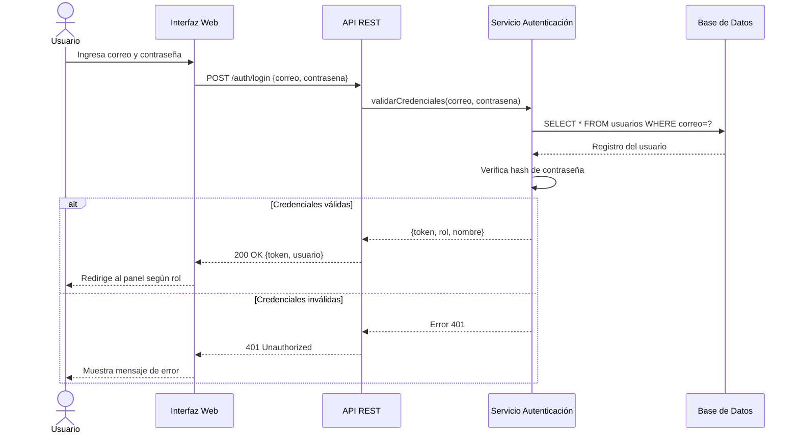
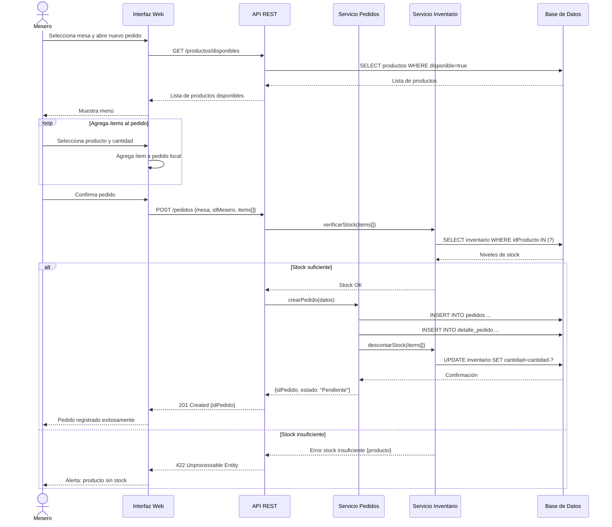
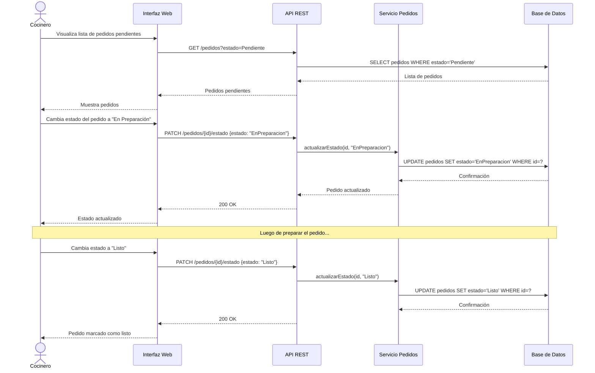
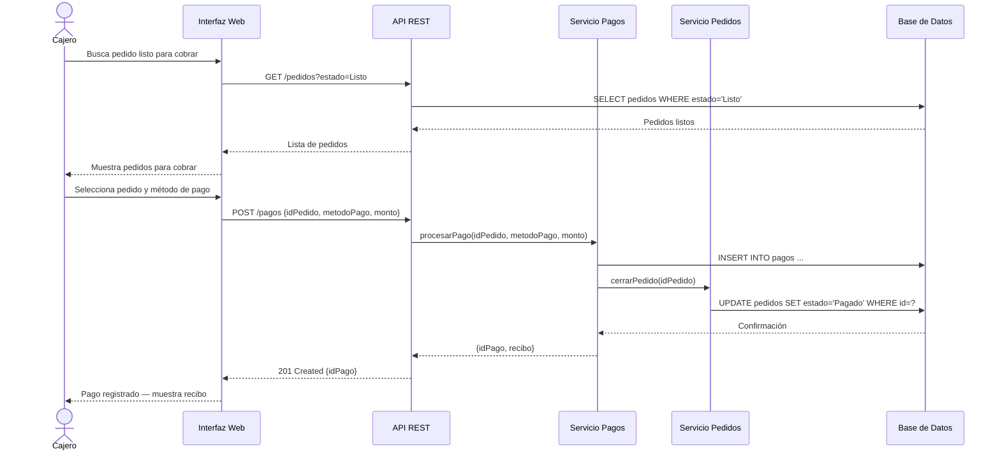

# Diagramas de Secuencia — Sistema de Gestión de Pedidos e Inventario

---

## SD-01: Iniciar Sesión

---

## SD-02: Registrar Pedido

---

## SD-03: Actualizar Estado de Pedido (Cocinero)

---

## SD-04: Procesar Pago

