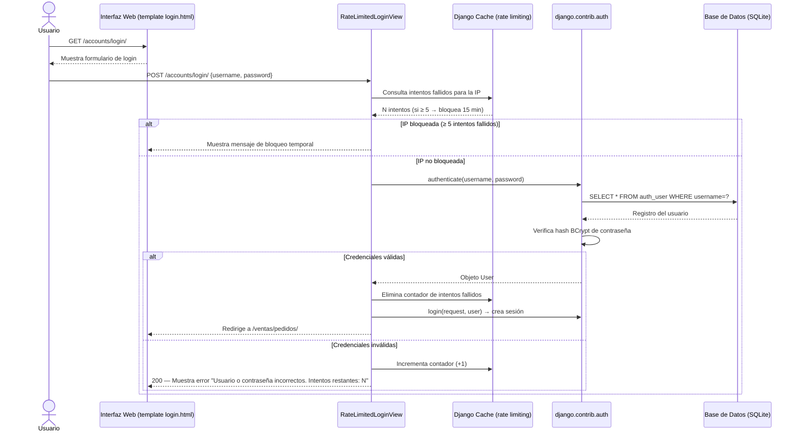
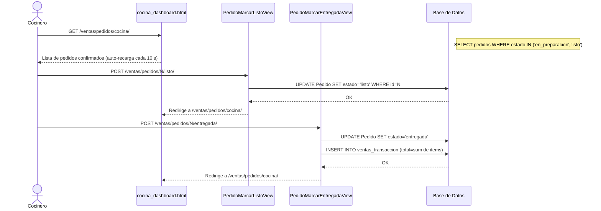
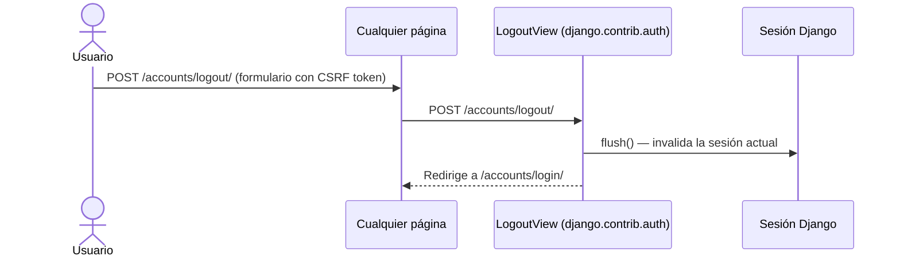

# Diagramas de Secuencia — Sistema de Gestión de Pedidos e Inventario

> Los diagramas reflejan la implementación real del proyecto (Django + sesiones).

---

## SD-01: Iniciar Sesión (RF-13)



---

## SD-02: Crear y Confirmar Orden (RF-03 + RF-04 + RF-05)

```mermaid
sequenceDiagram
    actor Mesero
    participant UI as Interfaz Web (pedido_form / pedido_detail)
    participant CV as PedidoCreateView
    participant DV as PedidoDetailView
    participant CFV as PedidoConfirmarView
    participant DB as Base de Datos

    %% RF-03: Crear orden
    Mesero->>UI: GET /ventas/pedidos/nuevo/
    UI-->>Mesero: Formulario "Nueva Orden"

    Mesero->>CV: POST /ventas/pedidos/nuevo/ {mesa_o_online}
    CV->>DB: INSERT INTO ventas_pedido (estado='pendiente', creado_por=user)
    DB-->>CV: Pedido #N
    CV-->>UI: Redirige a /ventas/pedidos/N/ + mensaje "Orden #N creada"

    %% RF-04: Modificar orden
    loop Agrega / ajusta productos (estado='pendiente')
        Mesero->>DV: POST /ventas/pedidos/N/ {producto, cantidad}
        DV->>DB: INSERT / UPDATE ventas_pedidoproducto
        DB-->>DV: OK
        DV-->>UI: Redirige a /ventas/pedidos/N/ (total actualizado)
    end

    opt Cambiar cantidad
        Mesero->>UI: POST /pedidos/N/items/M/incrementar/ o /disminuir/
        Note right of DB: UPDATE cantidad; si llega a 0 → DELETE
    end

    opt Eliminar producto
        Mesero->>UI: POST /pedidos/N/items/M/eliminar/ (con confirmación JS)
        Note right of DB: DELETE FROM ventas_pedidoproducto
    end

    %% RF-05: Confirmar orden
    Mesero->>UI: Click "Confirmar Orden" (diálogo JS de confirmación)
    Mesero->>CFV: POST /ventas/pedidos/N/confirmar/
    CFV->>DB: SELECT items + ingredientes con cantidades receta
    DB-->>CFV: Requisitos de ingredientes

    alt Stock insuficiente
        CFV-->>UI: Muestra lista de ingredientes faltantes
    else Stock suficiente
        CFV->>DB: UPDATE stock de ingredientes (descuento)
        CFV->>DB: INSERT MovimientoInventario por cada ingrediente
        CFV->>DB: UPDATE Pedido SET estado='en_preparacion'
        CFV-->>UI: Redirige a /ventas/pedidos/N/ + mensaje "Enviado a cocina"
    end
```

---

## SD-03: Actualizar Estado de Pedido (Cocinero — RF-08/09)



---

## SD-04: Cerrar Sesión (RF-13)



